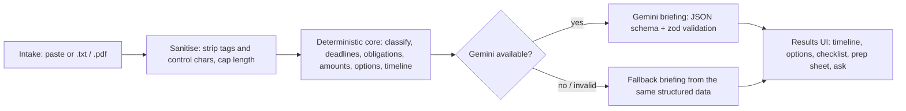

# Docket

Understand a legal notice you just received: what it is, what it asks of you, when the deadlines fall, what your realistic options are, and how to prepare for a conversation with a lawyer or legal-aid clinic.

> [!IMPORTANT]
> **Information, not legal advice.** Docket provides general information to help you understand a document. It is not legal advice, does not create an attorney-client relationship, and may miss details that matter. Confirm deadlines with the issuing body and consult a licensed legal professional or legal-aid organisation before acting.

<!-- Replace OWNER with your GitHub user or organisation in the badge and demo URLs below. -->

[](https://github.com/OWNER/docket/actions/workflows/ci.yml)
[](LICENSE)
[](.nvmrc)
[](tsconfig.base.json)
[](web)
[](server)
[](server/src/ai)

## Problem statement alignment

The brief asks for an AI-powered solution that helps people navigate legal documents: simplifying them, comparing them, surfacing obligations and risks, answering questions about them, explaining options, producing actionable outputs, and preparing users for a professional, while assisting rather than replacing legal advice.

Docket takes the **"understand your options and next steps"** and **"prepare for a legal professional"** vertical, applied to documents a person _receives_ (eviction notices, demand letters, court summonses, debt-collection letters, employment notices, insurance denials) rather than contracts they negotiate. The persona is a tenant, employee, consumer, or small-business owner with no legal training and a deadline approaching.

| Brief use case                                                    | What Docket does                                                                                                                                                                                                                                           | Where in the code                                                                                                                                |
| ----------------------------------------------------------------- | ---------------------------------------------------------------------------------------------------------------------------------------------------------------------------------------------------------------------------------------------------------- | ------------------------------------------------------------------------------------------------------------------------------------------------ |
| Simplifying complex legal documents                               | Classifies the document, then produces a plain-language "what this is", a summary under 120 words, key points, and a glossary of the legal terms used.                                                                                                     | [classify.ts](packages/core/src/classify.ts), [briefing.ts](server/src/ai/briefing.ts), [Terms.svelte](web/src/components/Terms.svelte)          |
| Comparing contracts, agreements, or policies                      | Honest scope note: Docket does not diff two documents. It compares the notice's extracted deadlines and obligations against a catalogue of typical options for that document kind, and shows the trade-offs of each path side by side.                     | [options.ts](packages/core/src/options.ts), [Options.svelte](web/src/components/Options.svelte)                                                  |
| Highlighting important clauses, obligations, risks                | Extracts every deadline, "you must" obligation, and dollar amount with its source sentence; assigns severity by proximity and kind; shows a dated timeline with non-colour severity badges.                                                                | [deadlines.ts](packages/core/src/deadlines.ts), [obligations.ts](packages/core/src/obligations.ts), [timeline.ts](packages/core/src/timeline.ts) |
| Answering questions based on provided documents                   | The Ask panel answers only from the document and the structured analysis, returns supporting quotes, and marks an answer `grounded: false` with a referral when the document does not contain the answer. Citations are checked against the document text. | [analysis.ts](server/src/routes/analysis.ts), [AskPanel.svelte](web/src/components/AskPanel.svelte)                                              |
| Helping users understand options and next steps                   | Three or four options per document kind, each with pros, cons, urgency, and a typical next step, plus a model-written note on what each option means for this specific notice.                                                                             | [options.ts](packages/core/src/options.ts), [prompts.ts](server/src/ai/prompts.ts)                                                               |
| Generating summaries, checklists, actionable outputs              | A checklist whose items link back to specific deadlines, persisted per analysis in the browser; a printable prep sheet.                                                                                                                                    | [Checklist.svelte](web/src/components/Checklist.svelte), [fallback.ts](packages/core/src/fallback.ts)                                            |
| Helping users prepare information or questions for a professional | The prep sheet lists questions to ask, documents to gather, and facts to write down before the meeting, with a print layout.                                                                                                                               | [PrepSheet.svelte](web/src/components/PrepSheet.svelte), [app.css](web/src/app.css)                                                              |
| Providing assistance rather than replacing professional advice    | One disclaimer constant appears on four surfaces: every UI view, every API response, every model prompt, and every fallback path. Every option points to a professional as the decision-maker.                                                             | [types.ts](packages/core/src/types.ts) (`DISCLAIMER`), [Disclaimer.svelte](web/src/components/Disclaimer.svelte)                                 |

## How it works

Paste or upload a notice, pick the date you received it, and Docket runs a fixed pipeline: the text is sanitised, a deterministic core extracts the document kind, deadlines, obligations, amounts, and options, and Gemini is then asked to _explain_ that structured result in plain language under a strict JSON schema. If the model is unavailable or returns something that fails validation, a templated briefing built from the same structured data is shown instead, and the response says so.



**Design thesis: deterministic core, language model as a language layer.** Every fact the user sees (kind, dates, amounts, options) comes from typed, unit-tested code in `packages/core`. Gemini rewrites and explains that output; it is never the source of a date, an amount, or an option, so those cannot be hallucinated. The model adds what code cannot: readable prose, tailored option notes, a glossary, and grounded answers.

### Supported documents

| Kind                | Typical signals                                                                 | Example options in the catalogue                                       |
| ------------------- | ------------------------------------------------------------------------------- | ---------------------------------------------------------------------- |
| `eviction_notice`   | "notice to quit", "unlawful detainer", "pay or quit"                            | Pay or cure and stay, negotiate a move-out date, contest, legal aid    |
| `demand_letter`     | "demand for payment", "cease and desist", "failure to comply"                   | Respond in writing, negotiate, dispute, consult counsel                |
| `court_summons`     | "summons", "you are hereby summoned", "plaintiff"                               | File an answer, seek an extension, consult counsel, understand default |
| `debt_collection`   | "validation notice", "debt collector", "FDCPA"                                  | Request validation, dispute in writing, negotiate, seek help           |
| `employment_notice` | "performance improvement", "termination of employment", "final written warning" | Respond in writing, request records, consult counsel, review benefits  |
| `insurance_denial`  | "claim denied", "adjuster", "appeal rights"                                     | Internal appeal, external review, gather records, consult counsel      |
| `unknown`           | no signal scored                                                                | Three generic options: read carefully, note dates, seek help           |

The classifier reports its confidence and the phrases that drove the decision, so the UI can show why a document was labelled the way it was.

## Quickstart

Prerequisites: Node 22 (see [.nvmrc](.nvmrc)) and a Gemini API key for live mode.

```bash
npm ci
cp server/.env.example server/.env        # then put your key in GEMINI_API_KEY
npm run dev -w server                     # API at http://localhost:8787
npm run dev -w web                        # UI  at http://localhost:5173
```

To point the UI at the local API, create `web/.env.local` containing:

```
VITE_API_BASE=http://localhost:8787
```

Without `VITE_API_BASE` the UI runs in demo mode (see below).

```bash
npm test          # all workspaces, offline, no key needed
npm run verify    # format check + lint + typecheck + test + build
```

**Mock mode.** Set `DOCKET_AI_MODE=mock` in `server/.env` to run the whole server without a key. It never touches the network and uses the deterministic fallback briefing. Tests and CI always run in mock mode.

**Secrets.** `server/.env` is gitignored. The key lives only there (or in your shell environment); it is never read by the web bundle and never logged.

### Configuration

Server (`server/.env`, validated at boot by [config.ts](server/src/config.ts)):

| Variable                | Default                 | Meaning                                                  |
| ----------------------- | ----------------------- | -------------------------------------------------------- |
| `GEMINI_API_KEY`        | none                    | Required when `DOCKET_AI_MODE=live`. Never committed.    |
| `DOCKET_AI_MODE`        | `live`                  | `live` calls Gemini; `mock` runs fully offline.          |
| `PORT`                  | `8787`                  | Port the API listens on.                                 |
| `CORS_ORIGINS`          | `http://localhost:5173` | Comma-separated list of origins allowed to call the API. |
| `RATE_LIMIT_PER_MINUTE` | `60`                    | Requests per minute per IP before `429`.                 |
| `MAX_UPLOAD_BYTES`      | `2000000`               | Body and file size cap in bytes (2 MB).                  |

Web (`web/.env.local`, read by Vite at build time):

| Variable        | Default | Meaning                                                                |
| --------------- | ------- | ---------------------------------------------------------------------- |
| `VITE_API_BASE` | empty   | API origin. Empty means demo mode: the core runs in the browser.       |
| `VITE_BASE`     | `/`     | Public base path; the Pages workflow sets it to `/<repository-name>/`. |

### Live demo

<!-- Replace OWNER below. -->

https://OWNER.github.io/docket/

The GitHub Pages build is **demo mode**: it runs the deterministic core directly in the browser and pairs it with pre-generated Gemini briefings for the three built-in sample notices. Pasted text is analysed in the browser and gets the deterministic fallback briefing with a visible "demo mode" note; the Ask panel is disabled with an explanation. The full pipeline (live Gemini briefings, PDF upload, grounded questions) needs the local server.

## Architecture

```
docket/
├── packages/core/   @docket/core: pure TypeScript, zero dependencies, no I/O
│   └── src/         types, classify, dates, deadlines, obligations, amounts,
│                    options, timeline, sanitize, fallback, analyze, samples
├── server/          Hono + @hono/node-server
│   └── src/         config, app, index, middleware/, routes/, ai/, store, cache, extract
├── web/             Svelte 5 + Vite, one hand-written CSS file
│   └── src/         App.svelte, lib/api.ts, lib/demo-briefings.json, views/, components/, app.css
├── docs/            DESIGN.md, decisions.md
└── .github/         workflows/ci.yml, workflows/pages.yml, dependabot.yml
```

**[packages/core](packages/core)** is the product. It classifies documents with weighted keyword signals, parses absolute and relative dates, extracts deadlines, obligations, and amounts with their source sentences, holds the options catalogue, builds the severity-ranked timeline, and can generate a complete briefing without any model. It has no dependencies and no I/O, so the same code runs on the server and in the browser.

**[server](server)** is a small Hono API. It validates its environment and every request with zod, extracts text from `.txt` or `.pdf`, sanitises it, checks a SHA-256 content cache, runs the core, asks Gemini for a schema-bound briefing with a model chain and retry, falls back deterministically, and keeps results in a bounded in-memory TTL store for the follow-up Ask feature.

**[web](web)** is a Svelte 5 single-page app with two views. Intake handles paste, keyboard-operable file drop, reference date, and sample chips. Results (lazy-loaded) shows the disclaimer, summary, timeline, options, checklist, prep sheet, glossary, and Ask panel. In demo mode the API client imports the core and runs it in the browser.

## API reference

| Method | Path                    | Body                                                                    | Response                               |
| ------ | ----------------------- | ----------------------------------------------------------------------- | -------------------------------------- |
| GET    | `/api/health`           | none                                                                    | `200 { ok, aiMode, model }`            |
| POST   | `/api/analyze`          | JSON `{ text, referenceDate? }` or multipart `file` (+ `referenceDate`) | `201 Analysis` (or `200` on cache hit) |
| GET    | `/api/analysis/:id`     | none                                                                    | `200 Analysis` or `404`                |
| POST   | `/api/analysis/:id/ask` | JSON `{ question }` (500 characters max)                                | `200 Answer`                           |

Limits: 2 MB body, `.txt` and `.pdf` only (PDF must start with `%PDF-`), text between 40 words and 60 000 characters, `referenceDate` as `yyyy-mm-dd` (defaults to today), 60 requests per minute per IP.

```bash
# Analyse pasted text
curl -s -X POST http://localhost:8787/api/analyze \
  -H 'content-type: application/json' \
  -d '{"text":"<the notice text, at least 40 words>","referenceDate":"2026-09-21"}'

# Analyse a file
curl -s -X POST http://localhost:8787/api/analyze -F file=@notice.pdf -F referenceDate=2026-09-21

# Ask a grounded question
curl -s -X POST http://localhost:8787/api/analysis/<id>/ask \
  -H 'content-type: application/json' \
  -d '{"question":"How many days do I have to respond?"}'
```

`Analysis` and `Answer` follow the types in [types.ts](packages/core/src/types.ts). Every `Analysis` carries `source: 'gemini' | 'fallback'` and the `disclaimer` string.

Errors use one envelope and never include a stack trace:

```json
{
  "error": {
    "code": "TOO_SHORT",
    "message": "Please paste at least 40 words so the document can be analysed."
  }
}
```

Codes and statuses: `TOO_SHORT` (400), `INVALID_DATE` (400), `BAD_REQUEST` (400, malformed JSON, missing field, bad id or question), `UNREADABLE_PDF` (400), `NOT_FOUND` (404), `TOO_LONG` (413), `PAYLOAD_TOO_LARGE` (413), `UNSUPPORTED_MEDIA_TYPE` (415), `TOO_MANY_REQUESTS` (429, with `Retry-After` and `RateLimit-*` headers), `INTERNAL_ERROR` (500).

## Security

- **Secure headers and CSP.** Hono secure headers on every response; the API CSP is `default-src 'none'`. [security.ts](server/src/middleware/security.ts)
- **CORS allowlist.** Only origins listed in `CORS_ORIGINS` may call the API. [config.ts](server/src/config.ts)
- **Rate limiting.** Fixed window, 60 requests per minute per IP, in memory. [rateLimit.ts](server/src/middleware/rateLimit.ts)
- **Body and file limits with a magic-byte check.** 2 MB cap, `.txt`/`.pdf` only, PDFs must begin with `%PDF-`. [extract.ts](server/src/extract.ts)
- **zod validation** of environment variables at boot, of every request body and parameter, and of every model response. [config.ts](server/src/config.ts), [schemas.ts](server/src/ai/schemas.ts)
- **Sanitisation.** Tags and control characters stripped, length capped to 60 000 characters before anything else sees the text. [sanitize.ts](packages/core/src/sanitize.ts)
- **Prompt-injection hardening.** The system prompt tells the model the document is untrusted data, to ignore any instructions inside it, and never to invent dates, amounts, or laws not present in the supplied analysis. [prompts.ts](server/src/ai/prompts.ts)
- **Citation integrity.** Quotes returned by the Ask endpoint are checked against the document text and unsupported citations are dropped; option notes and checklist links that point at ids the core did not produce are dropped the same way. [briefing.ts](server/src/ai/briefing.ts)
- **No persistence.** Analyses live in a `Map` bounded to 200 entries with a 24-hour TTL; nothing is written to disk. [store.ts](server/src/store.ts)
- **Log truncation.** Any document text that reaches a log line is cut to 80 characters.
- **Secrets stay out of the repo.** The Gemini key is read only from `server/.env` (gitignored) or the process environment.
- **Supply chain.** Dependabot for npm and GitHub Actions, `npm audit --audit-level=high` in CI, actions pinned to commit SHAs.

See [SECURITY.md](SECURITY.md) for the threat model and how to report a vulnerability.

## Accessibility

- Skip link to main content; `header`, `main`, `footer` landmarks; a single `h1` per view.
- Severity is shown as icon plus text, never colour alone.
- File drop zone is a real button: keyboard focusable and operable with Enter or Space.
- `aria-live` status line for analysing, done, and error states; `aria-busy` on the analyse button.
- Focus moves to the results heading after analysis and back to the text field on "Start over"; errors are announced in a `role="alert"` region.
- `prefers-reduced-motion` disables transitions.
- `color-scheme: light dark` with AA contrast checked in both schemes.
- Print stylesheet for the prep sheet.
- The app shell, the Results view, and the severity badge are checked with axe via `vitest-axe` in tests.

## Efficiency

- The deterministic core produces every fact, so no model call is spent on extraction.
- Exactly one schema-bound Gemini call per analysis, at `temperature 0.2` with a 30-second timeout.
- SHA-256 content cache: re-analysing the same text and date returns the stored result without a model call. Results that had to fall back because the model was unavailable are not cached in live mode, so the next identical request tries Gemini again. [cache.ts](server/src/cache.ts)
- Bounded stores: 200 analyses, 24-hour TTL, oldest evicted first.
- The Results view is a lazy-loaded chunk, so the intake bundle stays small.
- `@docket/core` has zero runtime dependencies; the whole tree is Hono, `@google/genai`, zod, a PDF text extractor, Svelte, and Vite.

## Testing

| Package         | What is covered                                                                                                     | Threshold |
| --------------- | ------------------------------------------------------------------------------------------------------------------- | --------- |
| `packages/core` | Every extractor, the classifier, date maths, timeline severity, sanitiser, fallback briefing, and the three samples | 100 %     |
| `server`        | Routes via `app.request()` in mock mode, middleware, store eviction and TTL, cache, extraction, schema validation   | 90 %      |
| `web`           | Components with `@testing-library/svelte` and `vitest-axe`, the API client in demo mode, view switching             | 85 %      |

Everything runs offline with no API key. Gemini calls are behind an interface that mock mode replaces, so no test ever reaches the network.

```bash
npm test                          # all packages with coverage
npm test -w packages/core         # one package
npx vitest run --root server      # one package, no coverage
```

## Assumptions and limitations

- Dates and currency are parsed in US formats (`MM/DD/YYYY`, `Month d, yyyy`, `$1,234.56`). Parsers are isolated so other locales can be added.
- Deadline maths is calendar days from the reference date. The UI says so and tells users to confirm with the issuing body or a professional; court and statutory rules about business days or service periods are not modelled.
- No jurisdiction-specific law. The options catalogue describes typical paths, not the rules of any state or country.
- No accounts, no database. Results live in server memory for at most 24 hours and are lost on restart.
- PDF extraction needs the server; the browser demo accepts text only.
- Model chain `gemini-3.8-flash` then `gemini-3.6-flash` then `gemini-3.5-flash`, one retry with backoff on 429/503 before moving down the chain. Any failure or invalid JSON falls back to the deterministic briefing and the response says `source: 'fallback'`.
- The classifier is keyword-based; an unfamiliar document is reported as `unknown` with generic options rather than guessed.

## Quality gates

ESLint 9 flat config with `typescript-eslint` `strictTypeChecked` and `stylistic`, plus `eslint-plugin-svelte`, with budgets `complexity: 10`, `max-lines-per-function: 60`, `max-lines: 250`, `max-depth: 3`, `max-params: 4`, and `--max-warnings 0`. Prettier (single quotes, width 100). TypeScript strict with `noUncheckedIndexedAccess` and `exactOptionalPropertyTypes`. CI runs `npm run verify` and `npm audit` on every push and pull request with read-only permissions and SHA-pinned actions. See [CONTRIBUTING.md](CONTRIBUTING.md) and [docs/decisions.md](docs/decisions.md).

## License

[MIT](LICENSE)
